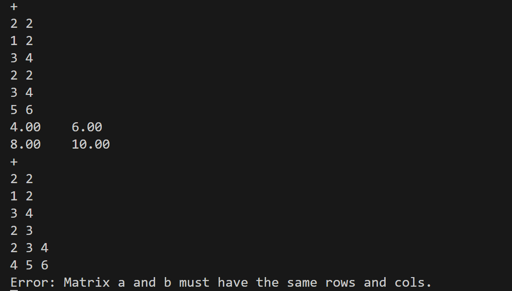
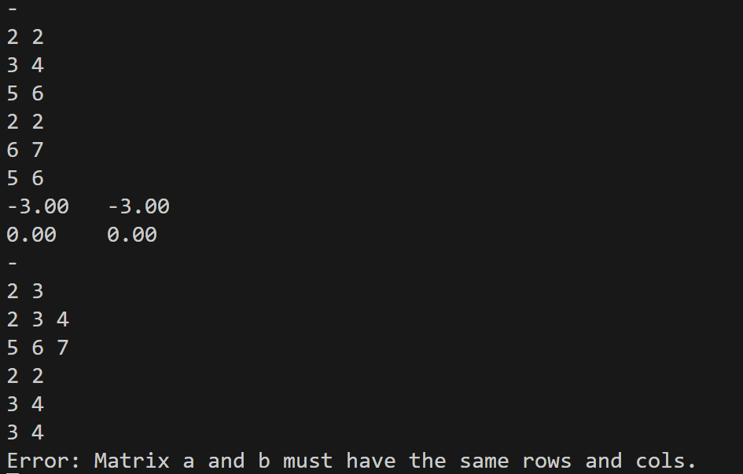
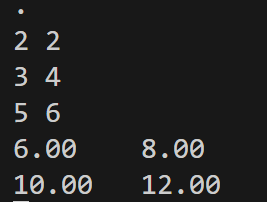
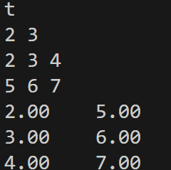
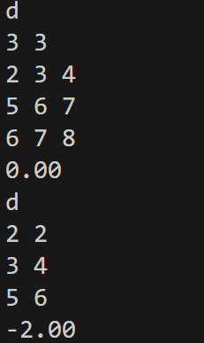
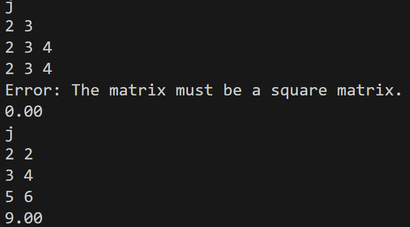

# algebra
硬件技术团队编程基础作业
## 课件资料 | Reference
* [课程PPT](https://tannin-1316822731.cos.ap-nanjing.myqcloud.com/2025-04-19-2025%E7%A1%AC%E4%BB%B6%E7%AC%AC%E4%B8%80%E6%AC%A1%E5%86%85%E8%AE%AD.pdf)
* [VSCode的C/C++环境配置教程](https://www.bilibili.com/video/BV1UZ421e7ty/?share_source=copy_web&vd_source=d82c2ec75577b6834f9f580f066180c1)
* [Git使用教程](https://www.bilibili.com/video/BV1og4y1u7XU/?share_source=copy_web&vd_source=d82c2ec75577b6834f9f580f066180c1)
## 预修要求｜Requirements
修读过《C程序设计基础》、《线性代数》以及X·Lab硬件技术团队编程基础课程或其对应的高阶课程。
## 说明｜Explainations
本题目的难度对于初学者而言相对较高，主要考察了基础的数学能力、通过编程解决问题的能力以及工程管理、CMake、git等综合能力。该作业的最终得分仅作参考，同学们可根据自己的能力来决定实现哪些函数。
## 题目背景｜Background
《线性代数》作为浙江大学工科多数专业必修的数学基础课程，对于其掌握是至关重要的，后续各大专业的专业课程也都离不开线性代数。然而，在后续的专业课程学习中，我们往往只需要计算一些矩阵的数值解，这个过程如果用手去计算的话是十分痛苦的。秉承着“我都学编程了就不要自己做一些无意义的事情”的原则，我们决定实现一个线性代数计算库，来辅助我们进行运算。
> 当然，如MATLAB、Python等高级编程语言已经可以做到这类事情，且做得更好，但这并不妨碍我们通过这样一种方式来锻炼自己的C语言编程能力。
## 题目介绍｜Introduction
本仓库给出了我们在内训中提到的工程模板，同学们要做的任务如下：
1. 自学git，注册GitHub账号，将本仓库在自己的GitHub账户下Fork一份（注意是Fork，禁止直接clone本仓库到本地，否则你将无法完成后续提交），并按照`yourname_hw1`的格式更改仓库名称（在仓库中的Settings处可修改，记得不要用中文，仓库权限为public，如涉及到隐私保护，可设为private，但要将`tanninrachel@yinlin.wiki`这个账户设置为协作者）。
2. 将你的仓库clone到本地。
3. 按照内训所讲的工程模板补充所缺的文件夹。
4. 根据`inc/algebra.h`中的注释和预定义，在`src/algebra.c`中实现对应的函数。
5. 根据内训所讲，自行编写`CMakeLists.txt`文件，使你的工程能够在本地成功编译运行。
6. 自学Markdown，修改`README.md`文件，需要包含你的实现思路（大致描述即可）以及本地运行截图。
7. 将你的修改提交到远程仓库，并将仓库链接提交（提交方式见下文）。
## 思路参考｜Thinking
见`doc`文件夹。
## 交互格式｜Format
在本题目中，`main.c`文件已给出，不需要同学们自己实现，也请不要更改这个文件，否则可能出现判题错误。
### 输入格式
本题目采用帧判定的思路进行，每一帧的第一行指令代码，`+`、`-`、`*`、`.`、`t`、`d`、`i`、`r`、`j`分别测试`add_matrix`、`sub_matrix`、`mul_matrix`、`scale_matrix`、`transpose_matrix`、`det_matrix`、`inv_matrix`、`rank_matrix`、`trace_matrix`函数，`q`表示退出。

接下来的一行输入矩阵 $\mathbf{A}$ 的行数 $m$ 和列数 $n$ ，在接下来的 $m$ 行中输入 $n$ 个双精度浮点数，以空格分开。
对于二元运算函数的测试，需要再按照上述过程输入矩阵 $\textbf{B}$ 。

可能的一次运行输入如下：
```
+
2 2
1.1 1.3
2.4 3.7
2 2
3.1 4.3
5.1 7.1
+
2 2
1.1 1.2
2.4 3.5
2 3
1 2 2.1
3 2 3.3
q
```
### 输出格式
在每一帧中，依次根据输入的指令代码运行对应的函数，并给出函数的输出与标准值比对。上述输入的正确输出如下：
```
4.20    5.60    
7.50    10.80
Error: Matrix a and b must have the same rows and cols.
```
## 评分标准｜Standard
* 成功运行：+25分
* `add_matrix`、`sub_matrix`、`mul_matrix`、`scale_matrix`、`transpose_matrix`、`trace_matrix`功能正常每个+5分
* `det_matrix`、`inv_matrix`、`rank_matrix`功能正常共+10分（此处为附加题，有一定难度，可选做）
> 为了保证题目难度，每个函数具体的评分标准不予公布。
## 提交方式｜Submit
将你的每个函数的测试运行结果以截图的形式放在你仓库的`README.md`文件中（请注意Markdown中图片的引用要包含源文件）。并将你的最终代码仓库链接（在浏览器上的那个，不要带有`.git`的）填写如下问卷发送：


### 我的思路
其实没有什么思路，基本就是按照那个doc文件里面给的一些提示来写东西，行列式主要用了递归，然后cmake和Makefile的操作研究了好久，感谢学长的帮助。
### 运行截图
#### 加法

#### 减法

#### 乘法

#### 数乘

#### 转置

#### 行列式

#### 矩阵的迹

